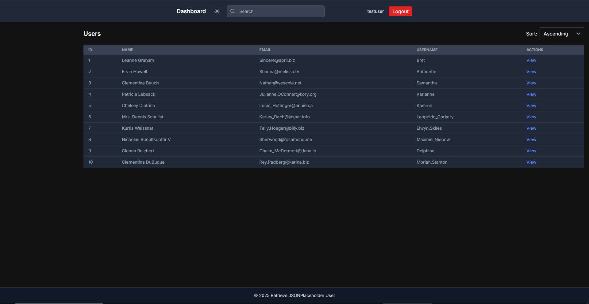

# Retrieve JSONPlaceholder User - Next.js

This project is a Next.js (app router) dashboard demo that fetches users and posts from the JSONPlaceholder API, provides a small JWT-based login flow (dev-only), and example pages/components for listing users and viewing details.

Important: This is a demo/starter project. The login and persistence are mocked for development.



## Local development

Prerequisites

- Node 18+ (Node 20 recommended) and npm
- Docker (optional, for building a container)

Install dependencies

```powershell
npm install
```

Run the dev server

```powershell
npm run dev
```

Open http://localhost:3000

## Login

This demo implements a very small, hard-coded login for development convenience. Use these credentials on the sign-in page:

- Email: `testuser`
- Password: `testpass`

On successful login the server sets an httpOnly cookie named `token`. This is only for demo/testing and not secure for production.

## Tests

Unit tests are powered by Vitest and Testing Library for simple logic tests.

Run tests:

```powershell
npm run test
```

Notes:

- A Flowbite-dependent Sidebar test was skipped because Flowbite/Next imports require extra test mocking. The pure-logic tests run and pass.

## Docker

Build the production image:

```powershell
docker build -t retrieve-jsonplaceholder-user-next .
```

Run the container:

```powershell
docker run --rm -p 3000:3000 retrieve-jsonplaceholder-user-next
```

The container runs the Next.js production server and exposes port 3000.

## Project highlights

- Next.js (app router) with server and client components
- Tailwind CSS + Flowbite for UI (some components are Flowbite-based)
- Small JWT-based login (dev credentials above)
- API proxy routes that fetch and cache data from JSONPlaceholder
- Example dynamic user detail page

## Security & Production notes

- Replace the demo JWT/token code with a properly secured auth system in production.
- Do not hard-code credentials in production.
- Ensure secure cookie attributes and HTTPS in production.

## Next steps / ideas

- Add persistent backend for updating users instead of in-memory mock
- Add full client-side state management for search/sort/filter
- Add E2E tests or component tests with proper mocking

---
